# BÁO CÁO THỰC TẬP: XÂY DỰNG THƯ VIỆN STATIC VÀ SHARED TRONG C

* **Người thực hiện:** Ninh
* **Hệ điều hành:** Ubuntu 22.04 LTS (Linux x86_64, GCC 11.4.0)
* **Mục tiêu:** Xây dựng thư viện xử lý chuỗi ký tự `strutils`, đóng gói thành cả static library (`.a`) và shared library (`.so`), xây dựng chương trình kiểm thử bao quát các trường hợp biên và chứng minh sự khác biệt giữa hai loại liên kết.

---

## 1. CẤU TRÚC THƯ MỤC DỰ ÁN

```text
c_library_project/
├── strutils.h          # File header khai báo các hàm mà thư viện cung cấp
├── strutils.c          # File mã nguồn cài đặt chi tiết các hàm
├── main.c              # File chương trình kiểm thử tự động
├── memory_layout.c     # File chương trình kiểm thử tự động
├── README.md           # Báo cáo kỹ thuật chi tiết
└── docs/
    └── images/         # Thư mục lưu trữ ảnh chụp màn hình kết quả
```


## 2. BÀI 1: THIẾT KẾ VÀ CÀI ĐẶT THƯ VIỆN STRUTILS

### 2.1. Yêu cầu thiết kế
Thư viện cung cấp tối thiểu 3 hàm xử lý chuỗi:
1. `str_reverse`: Đảo ngược một chuỗi ký tự tại chỗ (in-place).
2. `str_trim`: Xóa khoảng trắng ở đầu và cuối chuỗi tại chỗ (in-place).
3. `str_to_int`: Chuyển chuỗi sang số nguyên an toàn, có khả năng phát hiện lỗi đầu vào và lỗi tràn số.

### 2.2. Cách làm và giải thích thuật toán

#### Hàm 1: bool str_reverse(char *str)
* **Mục đích:** Đảo ngược chuỗi trực tiếp trên mảng bộ nhớ được truyền vào (in-place), không cấp phát thêm bộ nhớ động.
* **Cách thực hiện:**
  1. Kiểm tra an toàn: Nếu `str == NULL`, hàm trả về `false` ngay để chống lỗi truy cập bộ nhớ không hợp lệ (Segmentation fault).
  2. Lấy độ dài chuỗi bằng hàm `strlen(str)`. Nếu độ dài chuỗi nhỏ hơn hoặc bằng 1, hàm giữ nguyên và trả về `true`.
  3. Sử dụng kỹ thuật hai con trỏ: Thiết lập con trỏ `left = 0` (đầu chuỗi) và `right = len - 1` (cuối chuỗi).
  4. Trong vòng lặp `while (left < right)`, tiến hành hoán đổi giá trị của ký tự tại `left` và `right`, sau đó tăng `left++` và giảm `right--`.
  5. Quá trình kết thúc khi hai con trỏ gặp nhau. Độ phức tạp thời gian đạt O(n) và không tốn bộ nhớ phụ O(1).

#### Hàm 2: bool str_trim(char *str)
* **Mục đích:** Xóa tất cả các ký tự khoảng trắng thừa (`' '`, `'\t'`, `'\n'`, `'\r'`) ở cả đầu và cuối chuỗi tại chỗ (in-place).
* **Cách thực hiện:**
  1. Kiểm tra an toàn: Nếu `str == NULL`, trả về `false`.
  2. Dùng con trỏ `start` duyệt từ đầu chuỗi qua tất cả các ký tự khoảng trắng (dùng hàm `isspace()` của thư viện `<ctype.h>`).
  3. Nếu `*start == '\0'` (chuỗi ban đầu chỉ chứa toàn khoảng trắng), gán `str[0] = '\0'` và kết thúc.
  4. Dùng con trỏ `end` duyệt từ cuối chuỗi ngược về trước để tìm ký tự có nghĩa cuối cùng.
  5. Đặt ký tự kết thúc chuỗi `\0` ngay sau vị trí `end` bằng lệnh `*(end + 1) = '\0'`.
  6. Nếu ở đầu chuỗi có khoảng trắng (`start != str`), dùng hàm `memmove(str, start, length)` để dịch chuyển phần nội dung hợp lệ về lại đầu mảng `str`.
  * **Lưu ý kỹ thuật:** Bắt buộc sử dụng `memmove` thay vì `memcpy` do vùng nhớ nguồn (`start`) và vùng nhớ đích (`str`) bị chồng lấn nhau (overlapping memory).

#### Hàm 3: int str_to_int(const char *str, int *out_val)
* **Mục đích:** Chuyển đổi an toàn chuỗi ký tự sang số nguyên `int`, kiểm soát triệt để lỗi nhập liệu và tràn số.
* **Cách thực hiện:**
  1. Kiểm tra tham số đầu vào: Nếu `str == NULL` hoặc con trỏ nhận giá trị `out_val == NULL`, trả về mã lỗi `-1`.
  2. Bỏ qua các ký tự khoảng trắng ở đầu chuỗi. Nếu sau khi bỏ khoảng trắng gặp ngay ký tự `\0` (chuỗi rỗng), trả về mã lỗi `-1`.
  3. Sử dụng hàm chuẩn `strtol()` kết hợp con trỏ kiểm tra `endptr` và biến hệ thống `errno`:
     * Gán `errno = 0` trước khi gọi `strtol`.
     * Nếu `endptr == str`: Không tìm thấy chữ số nào hợp lệ, trả về `-1`.
     * Duyệt qua khoảng trắng ở cuối chuỗi; nếu sau đó vẫn còn ký tự lạ (ví dụ `"123abc"`), trả về mã lỗi `-1`.
     * Kiểm tra tràn số: Nếu `errno == ERANGE` hoặc giá trị trả về nằm ngoài khoảng `[INT_MIN, INT_MAX]` của kiểu `int` 32-bit, trả về mã lỗi `-2`.
  4. Nếu các điều kiện đều hợp lệ, gán kết quả chuyển đổi vào `*out_val` và trả về mã thành công `0`.

### 2.3. Lệnh biên dịch và chạy kiểm thử Bài 1
```bash
# Biên dịch file strutils.c thành file đối tượng .o
gcc -Wall -Wextra -c strutils.c -o strutils.o

# Biên dịch chương trình kiểm thử main.c liên kết với strutils.o
gcc -Wall -Wextra main.c strutils.o -o main_test

# Chạy chương trình kiểm thử
./main_test
```

### 2.4. Kết quả thực thi Bài 1

<p align="center">
  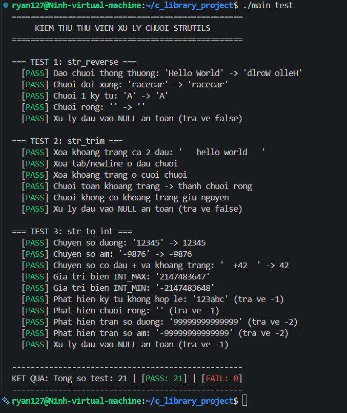<br>
  <em>Hình 1: Kết quả thực thi kiểm thử của ./main_test.</em>
</p>

## 3. BÀI 2: ĐÓNG GÓI THƯ VIỆN STATIC VÀ SHARED

### 3.1. Đóng gói Static Library (libstrutils.a)
* **Mục đích:** Đóng gói mã máy của thư viện vào một file lưu trữ `.a` để nhúng trực tiếp vào file thực thi tại thời điểm liên kết.
* **Các lệnh thực hiện:**
```bash
# Bước 1: Biên dịch strutils.c thành object file thông thường
gcc -Wall -Wextra -c strutils.c -o strutils.o

# Bước 2: Đóng gói file .o thành thư viện tĩnh .a bằng tiện ích 'ar'
ar rcs libstrutils.a strutils.o
```
* **Giải thích các cờ của lệnh `ar rcs`:**
  * `r`: Thay thế hoặc thêm các file object vào kho lưu trữ `.a`.
  * `c`: Tạo mới file kho lưu trữ nếu chưa tồn tại.
  * `s`: Tạo bảng chỉ mục ký hiệu hàm giúp trình liên kết tìm kiếm hàm nhanh chóng.

### 3.2. Đóng gói Shared Library (libstrutils.so)
* **Mục đích:** Tạo thư viện liên kết động `.so` để nhiều chương trình có thể dùng chung mã máy trong bộ nhớ RAM tại thời điểm thực thi (Runtime).
* **Các lệnh thực hiện:**
```bash
# Bước 1: Biên dịch strutils.c với cờ -fPIC
gcc -Wall -Wextra -fPIC -c strutils.c -o strutils_pic.o

# Bước 2: Tạo shared library từ file object độc lập vị trí
gcc -shared strutils_pic.o -o libstrutils.so
```
* **Giải thích các cờ:**
  * `-fPIC` (Position Independent Code): Buộc trình biên dịch sinh ra mã máy sử dụng địa chỉ tương đối (thông qua bảng GOT/PLT) thay vì địa chỉ tuyệt đối. Điều này cho phép hệ điều hành nạp file `.so` vào bất kỳ phân vùng địa chỉ ảo nào của RAM mà không gây xung đột giữa các tiến trình.
  * `-shared`: Báo cho GCC tạo ra file thư viện động (Dynamic Shared Object).

### 3.3. Kết quả đóng gói thư viện

* **Lệnh kiểm tra file sinh ra:**
```bash
ls -lh libstrutils.a libstrutils.so
```

<p align="center">
  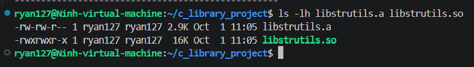<br>
  <em>Hình 2: Kết quả thực thi kiểm thử file thư viện tĩnh và động.</em>
</p>


## 4. BÀI 3: BIÊN DỊCH, LIÊN KẾT VÀ CHỨNG MINH THỰC THI

### 4.1. Cách làm biên dịch và liên kết

#### Tạo file thực thi liên kết tĩnh (main_static):
```bash
gcc -Wall -Wextra main.c libstrutils.a -o main_static
```
* **Nguyên lý:** Trình liên kết trích xuất trực tiếp mã máy của các hàm `str_reverse`, `str_trim`, `str_to_int` từ `libstrutils.a` và sao chép toàn bộ vào bên trong file `main_static`. File thực thi này độc lập hoàn toàn và có thể chạy mà không cần bất kỳ file thư viện ngoài nào.

#### Tạo file thực thi liên kết động (main_shared):
```bash
gcc -Wall -Wextra main.c -L. -lstrutils -Wl,-rpath,. -o main_shared
```
* **Giải thích các tham số:**
  * `-L.`: Khai báo thư mục hiện tại làm nơi tìm kiếm thư viện lúc biên dịch.
  * `-lstrutils`: Liên kết với thư viện `libstrutils.so` (bỏ tiền tố `lib` và phần mở rộng `.so`).
  * `-Wl,-rpath,.`: Nhúng đường dẫn tìm kiếm thư viện lúc thực thi vào chính header ELF của file `main_shared`, giúp chương trình tự tìm thấy `libstrutils.so` tại thư mục hiện tại mà không cần thiết lập thủ công biến môi trường `LD_LIBRARY_PATH`.

### 4.2. Kết quả chạy chương trình
* Cả hai tệp thực thi `./main_static` và `./main_shared` khi chạy đều cho ra cùng kết quả kiểm thử chính xác (21/21 test cases đều PASS).

<p align="center">
  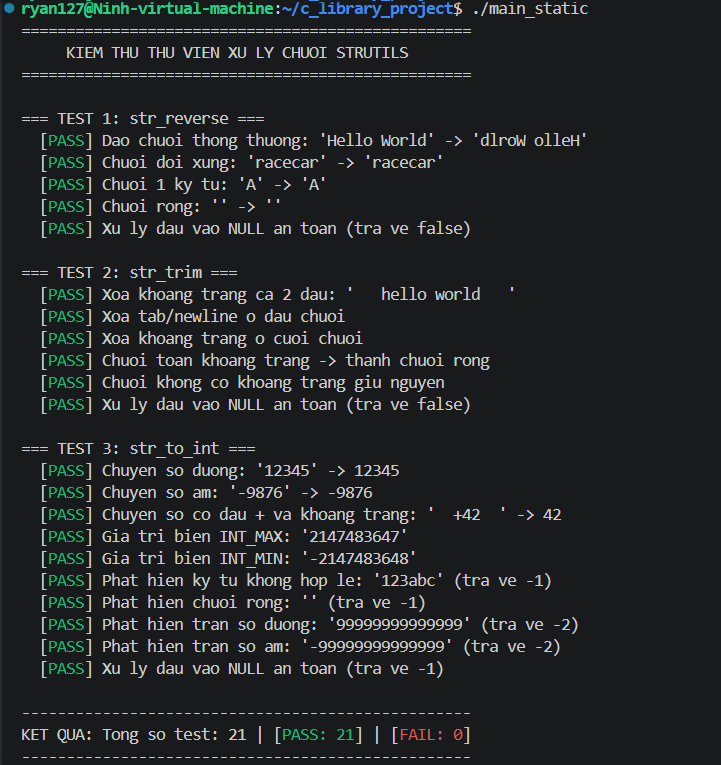<br>
  <em>Hình 3.1: Kết quả thực thi kiểm thử của main_static.</em>
</p>

<p align="center">
  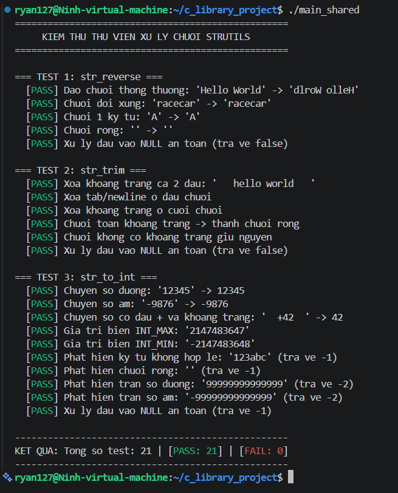<br>
  <em>Hình 3.2: Kết quả thực thi kiểm thử của main_shared.</em>
</p>


### 4.3. Chứng minh bản chất Static vs Shared bằng công cụ hệ thống

#### Kiểm tra sự phụ thuộc thư viện bằng lệnh `ldd`:
```bash
ldd main_static
ldd main_shared
```

<p align="center">
  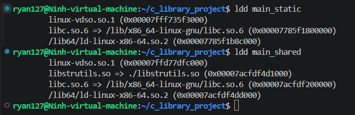<br>
  <em>Hình 3.3: Kết quả thực thi kiểm thử ldd giữa main_static và main_shared.</em>
</p>

* **Phân tích:** 
  * `main_shared` hiển thị sự phụ thuộc động vào `libstrutils.so => ./libstrutils.so`.
  * `main_static` không phụ thuộc vào `libstrutils.so` vì toàn bộ mã máy đã được nhúng trực tiếp bên trong tệp thực thi.


## 5. BÀI 4: TỰ ĐỘNG HÓA TOÀN BỘ VỚI MAKEFILE

### 5.1. Thiết kế và cấu trúc Makefile
File `Makefile` được xây dựng nhằm tự động hóa hoàn toàn chu trình phát triển:
* Quản lý chặt chẽ cây phụ thuộc (Dependency Graph) để hỗ trợ Incremental Build (chỉ biên dịch lại những file có thay đổi).
* Khai báo `.PHONY` cho các target giả (`all`, `static`, `shared`, `clean`, `test`).
* Bật đầy đủ các cờ cảnh báo nghiêm ngặt `-Wall -Wextra -std=c99`.

### 5.2. Các target trong Makefile
| Target | Lệnh gọi | Mô tả chức năng |
| :--- | :--- | :--- |
| `all` | `make` hoặc `make all` | Target mặc định, tự động build đầy đủ thư viện static, shared và cả 2 file thực thi. |
| `static` | `make static` | Chỉ build thư viện tĩnh `libstrutils.a` và tệp thực thi `main_static`. |
| `shared` | `make shared` | Chỉ build thư viện động `libstrutils.so` và tệp thực thi `main_shared`. |
| `clean` | `make clean` | Dọn dẹp toàn bộ file đối tượng (.o), file thư viện (.a, .so) và tệp thực thi. |
| `test` | `make test` | Tự động build và chạy lần lượt cả 2 tệp thực thi `main_static` và `main_shared`. |

### 5.3. Kết quả kiểm thử Makefile

<p align="center">
  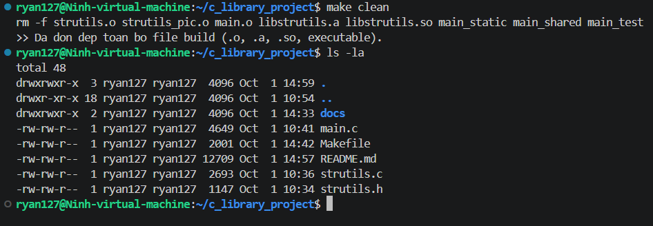<br>
  <em>Hình 4.1: Kiểm thử make clean.</em>
</p>

<p align="center">
  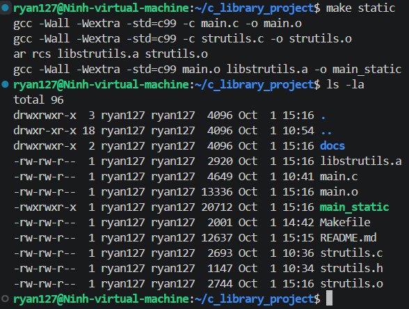<br>
  <em>Hình 4.2: Kiểm thử make static.</em>
</p>

<p align="center">
  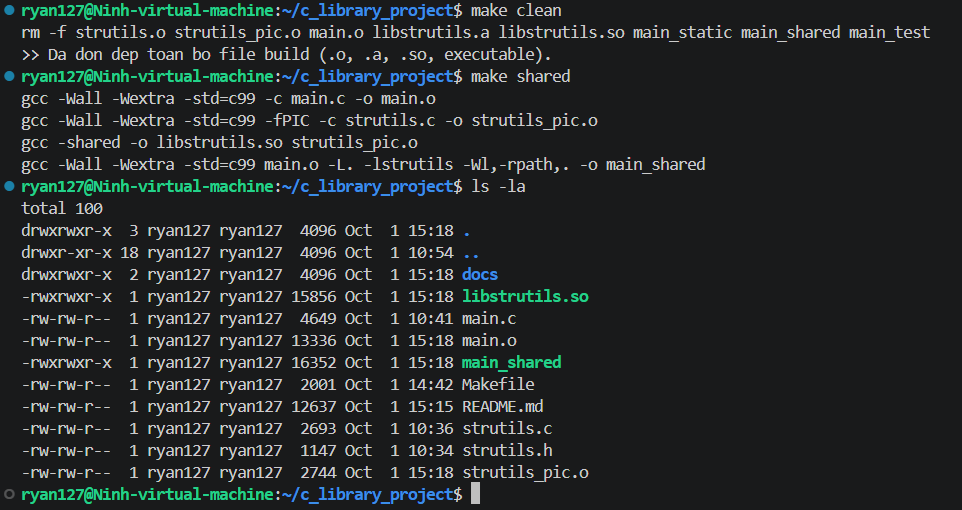<br>
  <em>Hình 4.3: Kiểm thử make shared.</em>
</p>

<p align="center">
  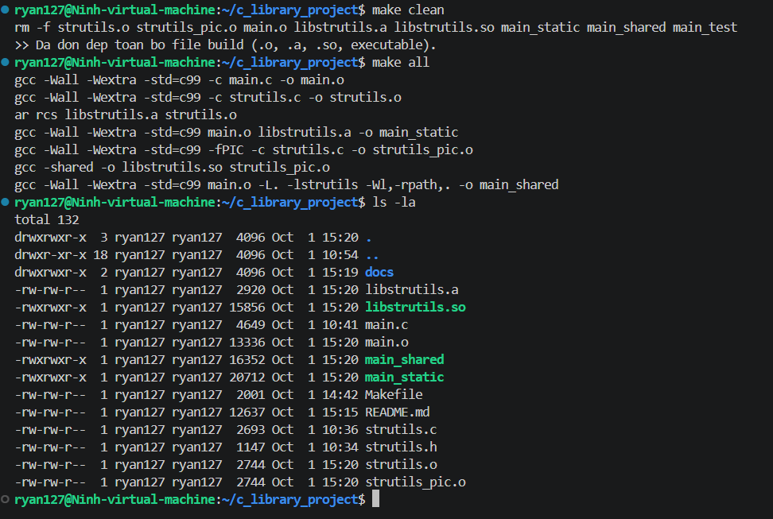<br>
  <em>Hình 4.4: Kiểm thử make all.</em>
</p>

<p align="center">
  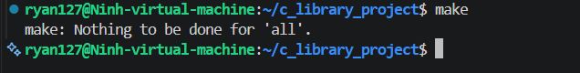<br>
  <em>Hình 4.5: Kiểm thử tính năng không build lại khi không có thay đổi.</em>
</p>

<p align="center">
  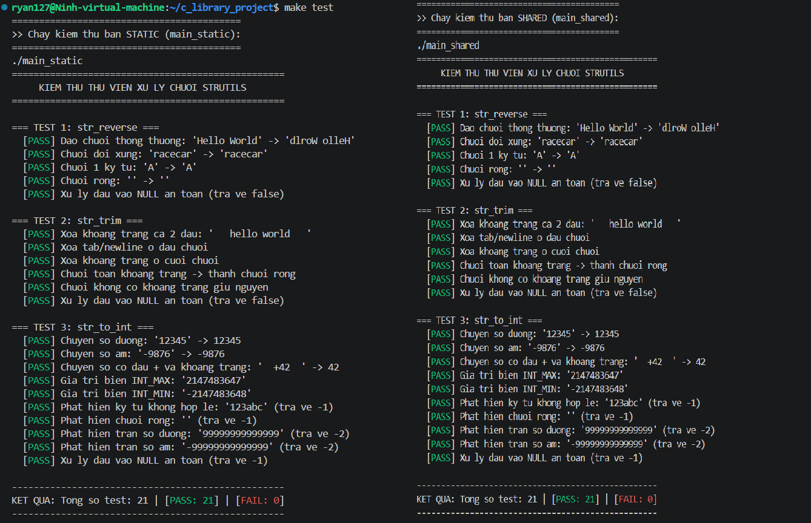<br>
  <em>Hình 4.6: Kiểm thử make test.</em>
</p>

---

## 6. BÀI 5: THÍ NGHIỆM VÀ TRẢ LỜI CÂU HỎI

### Câu 1: So sánh kích thước của main_static và main_shared. Giải thích sự khác biệt.

#### 1. Lệnh thực hiện:
```bash
size main_static main_shared
ls -lh main_static main_shared
```

#### 2. Kết quả thực nghiệm:
<div align="center">

.png)

*Hình 5.1: So sánh kích thước phân vùng bộ nhớ và dung lượng tệp tin.*

</div>

* Kết quả từ lệnh `size`:
  * `main_static`: Phân vùng mã lệnh (`text`) chiếm **7742 bytes** (Tổng kích thước phân vùng: **8422 bytes**).
  * `main_shared`: Phân vùng mã lệnh (`text`) chiếm **6639 bytes** (Tổng kích thước phân vùng: **7335 bytes**).

* Kết quả từ lệnh `ls -lh` (Dung lượng file trên ổ cứng):
  * `main_static`: **21 KB**
  * `main_shared`: **16 KB**

#### 3. Giải thích nguyên nhân:
* **`main_static` lớn hơn:** Do trình liên kết sao chép trực tiếp toàn bộ mã máy của các hàm trong `libstrutils.a` nhúng vào bên trong file thực thi.
* **`main_shared` nhỏ hơn:** Do file thực thi chỉ lưu địa chỉ tham chiếu và tên thư viện `libstrutils.so`; mã máy thực tế vẫn nằm ở file `.so` bên ngoài và chỉ được nạp vào RAM khi chạy chương trình.

---

### Câu 2: Xoá hoặc đổi tên libstrutils.so rồi chạy lại cả hai chương trình. Điều gì xảy ra? Vì sao?

#### 1. Lệnh thực nghiệm:
```bash
# Đổi tên file shared library để giả lập việc bị mất file
mv libstrutils.so libstrutils.so.bak

# Chạy lại 2 chương trình
./main_static
./main_shared

# Phục hồi lại file sau khi kiểm tra
mv libstrutils.so.bak libstrutils.so
```

#### 2. Kết quả quan sát:
<div align="center">

.png)

*Hình 5.2: Kết quả khi đổi tên / xóa libstrutils.so.*

</div>

* `./main_static`: Vẫn khởi chạy bình thường và vượt qua toàn bộ các test case.
* `./main_shared`: Bị hệ điều hành chặn lại ngay lập tức và báo lỗi.


#### 3. Giải thích nguyên nhân:
* **`main_static`:** Không phụ thuộc vào môi trường ngoài lúc chạy vì toàn bộ mã lệnh cần thiết đã được đóng gói sẵn bên trong file thực thi từ lúc biên dịch.
* **`main_shared`:** Là chương trình liên kết động. Khi người dùng chạy lệnh, trình nạp động của Linux (Dynamic Linker/Loader - `ld-linux.so`) sẽ đọc header ELF của file `main_shared`, tìm kiếm file `libstrutils.so` theo đường dẫn đã đăng ký để nạp vào RAM. Khi không tìm thấy file `libstrutils.so`, trình nạp động sẽ hủy tiến trình và cho ra lỗi trên.

---

### Câu 3: Sửa nội dung một hàm trong strutils.c. Với mỗi loại thư viện, cần làm gì để chương trình nhận được thay đổi?

#### 1. Thao tác đối với Static Library:
Để `main_static` nhận được cập nhật mã nguồn mới trong `strutils.c`:
1. Biên dịch lại `strutils.c` thành `strutils.o`:
   ```bash
   gcc -Wall -Wextra -c strutils.c -o strutils.o
   ```
2. Đóng gói lại thư viện tĩnh `libstrutils.a`:
   ```bash
   ar rcs libstrutils.a strutils.o
   ```
3. **Bắt buộc phải biên dịch và liên kết lại tệp thực thi `main_static`:**
   ```bash
   gcc -Wall -Wextra main.c libstrutils.a -o main_static
   ```
   * *Lý do:* Nếu không liên kết lại `main_static`, file thực thi vẫn tiếp tục giữ và chạy đoạn mã máy cũ đã được nhúng từ trước.

#### 2. Thao tác đối với Shared Library:
Để `main_shared` nhận được cập nhật mã nguồn mới trong `strutils.c`:
1. Biên dịch lại `strutils.c` với cờ `-fPIC`:
   ```bash
   gcc -Wall -Wextra -fPIC -c strutils.c -o strutils_pic.o
   ```
2. Tạo lại file thư viện động `libstrutils.so`:
   ```bash
   gcc -shared strutils_pic.o -o libstrutils.so
   ```
3. **Hoàn toàn không cần biên dịch lại tệp thực thi `main_shared`:**
   * Chỉ cần chạy lại `./main_shared`, trình nạp động sẽ tự động nạp file `libstrutils.so` mới vào bộ nhớ RAM và chương trình nhận ngay thay đổi logic mới.

---

### Câu 4: Khi build shared library cần thêm tuỳ chọn biên dịch gì so với static? Tại sao?

#### 1. Tùy chọn biên dịch cần thêm:
* Cờ biên dịch: **`-fPIC` (Position Independent Code)** khi biên dịch mã nguồn thành file đối tượng `.o`.
* Cờ liên kết: **`-shared`** khi đóng gói thành file `.so`.

#### 2. Giải thích nguyên nhân kỹ thuật:
* **Đối với Static Library:** Mã máy được nhúng cố định vào một tiến trình cụ thể, các địa chỉ hàm và biến toàn cục có thể được gán cố định tại thời điểm nạp tiến trình vào bộ nhớ.
* **Đối với Shared Library:** File `.so` được thiết kế để nạp vào bộ nhớ RAM một lần và chia sẻ dùng chung cho nhiều tiến trình khác nhau. Do không gian địa chỉ ảo (Virtual Address Space) của mỗi tiến trình là khác nhau, file `.so` không thể dùng địa chỉ ô nhớ cố định (Absolute Address).
* Cờ `-fPIC` buộc trình biên dịch sinh ra mã máy chỉ sử dụng **địa chỉ tương đối** (thông qua bảng định tuyến Global Offset Table - GOT và Procedure Linkage Table - PLT). Nhờ đó, file `.so` có thể được nạp vào bất kỳ địa chỉ bộ nhớ nào trong RAM mà vẫn thực thi chính xác.

---

### Câu 5: Có những cách nào để chương trình tìm thấy shared library khi chạy?

Hệ điều hành Linux tìm kiếm Shared Library theo thứ tự ưu tiên từ cao xuống thấp thông qua 5 cách sau:

1. **Sử dụng tùy chọn RPATH lúc biên dịch:**
   * Nhúng trực tiếp đường dẫn tìm thư viện vào trường `DT_RPATH` trong header của file thực thi.
   * Lệnh: `gcc main.c -L. -lstrutils -Wl,-rpath,. -o main_shared`
2. **Sử dụng biến môi trường `LD_LIBRARY_PATH`:**
   * Thiết lập danh sách các thư mục chứa thư viện trước khi chạy chương trình.
   * Lệnh: `export LD_LIBRARY_PATH=/duong/dan/thu/muc:$LD_LIBRARY_PATH`
3. **Sử dụng tùy chọn RUNPATH lúc biên dịch:**
   * Tương tự như RPATH nhưng có độ ưu tiên sau `LD_LIBRARY_PATH` (cho phép người dùng ghi đè đường dẫn bằng biến môi trường).
   * Lệnh: `gcc main.c -L. -lstrutils -Wl,-rpath,. -Wl,--enable-new-dtags -o main_shared`
4. **Cấu hình qua file `/etc/ld.so.conf` và bộ nhớ đệm `/etc/ld.so.cache`:**
   * Thêm đường dẫn thư mục chứa file `.so` vào file cấu hình hệ thống `/etc/ld.so.conf.d/custom.conf` và cập nhật lại bộ đệm hệ thống bằng lệnh `sudo ldconfig`.
5. **Đặt thư viện vào các thư mục hệ thống mặc định:**
   * Đưa file `.so` vào các thư mục chuẩn của Linux như `/lib`, `/usr/lib`, hoặc `/usr/local/lib`.

---

### Câu 6: Trong một hệ thống nhúng, khi nào nên chọn static, khi nào nên chọn shared?

#### 1. Trường hợp nên chọn Static Library:
* **Hệ thống đơn nhiệm / Đơn ứng dụng (Single Application):** Thiết bị nhúng chuyên dụng chỉ chạy duy nhất một chương trình chính (ví dụ vi điều khiển, thiết bị đo lường cảm biến).
* **Bộ nhớ RAM cực kỳ hạn chế:** Dùng static library giúp loại bỏ bộ nhớ phụ để nạp bảng biểu GOT/PLT và không cần chạy trình nạp động `ld-linux.so`.
* **Tối ưu tốc độ khởi động (Boot-up time):** Không mất thời gian nạp và phân giải ký hiệu động (Dynamic Symbol Resolution) lúc khởi động thiết bị.
* **Đơn giản hóa việc triển khai (Deployment):** Chương trình độc lập hoàn toàn, không lo lỗi thiếu thư viện hoặc xung đột phiên bản (Dependency Hell) khi cập nhật firmware.

#### 2. Trường hợp nên chọn Shared Library:
* **Hệ thống đa tiến trình (Multi-process Embedded Linux):** Thiết bị chạy nhiều ứng dụng đồng thời (ví dụ hệ thống giải trí ô tô - IVI, Gateway, Router) cùng dùng chung các thư viện cơ bản như `libc`, `libpthread`, `libssl`, `libcrypto`.
* **Tiết kiệm bộ nhớ RAM và Flash:** 
  * *Tiết kiệm RAM:* Nhiều tiến trình cùng chia sẻ một bản sao mã máy duy nhất của file `.so` trong RAM.
  * *Tiết kiệm Flash/ROM:* Lưu trữ một file `.so` cho 10 ứng dụng dùng chung sẽ tốn ít dung lượng ổ cứng hơn rất nhiều so với việc nhân bản mã máy vào cả 10 file thực thi.
* **Hỗ trợ cập nhật từng module (Hot-fix / Modular Update):** Khi phát hiện lỗi trong thư viện, chỉ cần cập nhật riêng file `.so` qua mạng (OTA) mà không cần phải biên dịch lại và thay thế toàn bộ firmware của hệ thống.


## 7. Bài tập bổ sung: TÌM HIỂU PHÂN VÙNG BỘ NHỚ TRONG C

### 7.1. Lý thuyết 5 phân vùng bộ nhớ
1. **Text Segment (Code & Read-Only Data):**
   * Chứa mã máy nhị phân thực thi (CPU Instructions) của các hàm (`main`, `str_reverse`...) và các hằng chuỗi ký tự (String Literals, vd: `"Hello"`).
   * Phân vùng này có quyền chỉ đọc (`Read-Only [RO/RX]`) để bảo vệ an toàn cho tiến trình, chống việc tự ý ghi đè làm thay đổi lệnh CPU.
2. **Data Segment (Initialized Data):**
   * Chứa các biến toàn cục (global) và biến tĩnh (static) đã được khởi tạo giá trị khác 0 trước khi chạy (`int g_data_var = 100;`).
   * Dữ liệu trong vùng này chiếm dung lượng trực tiếp trong tệp tin thực thi nhị phân (Binary ELF) và tồn tại trong suốt vòng đời của chương trình.
3. **BSS Segment (Block Started by Symbol / Uninitialized Data):**
   * Chứa các biến toàn cục và biến static chưa khởi tạo hoặc được khởi tạo tường minh bằng 0 (`int g_bss_var;`, `static int s_bss_zero = 0;`).
   * Không chiếm dung lượng lưu trữ trên ổ cứng; khi hệ điều hành nạp chương trình vào RAM, toàn bộ phân vùng này sẽ tự động được xóa về giá trị 0.
4. **Heap Segment (Bộ nhớ cấp phát động):**
   * Vùng nhớ được cấp phát và giải phóng động trong lúc chạy chương trình thông qua các hàm `malloc()`, `calloc()`, `realloc()`, và `free()`.
   * Lập trình viên tự quản lý vòng đời của vùng nhớ này. Heap phát triển đi lên (từ địa chỉ thấp lên địa chỉ cao hơn).
5. **Stack Segment (Bộ nhớ ngăn xếp):**
   * Lưu trữ các biến cục bộ (local variables), tham số truyền vào hàm, và địa chỉ trả về khi gọi hàm (Stack Frame).
   * Vùng nhớ này được hệ điều hành tự động cấp phát và giải phóng khi vào/ra khỏi hàm. Stack phát triển đi xuống (từ địa chỉ cao xuống địa chỉ thấp hơn).

### 7.2. Kết quả thực nghiệm in địa chỉ ô nhớ (%p)


<div align="center">

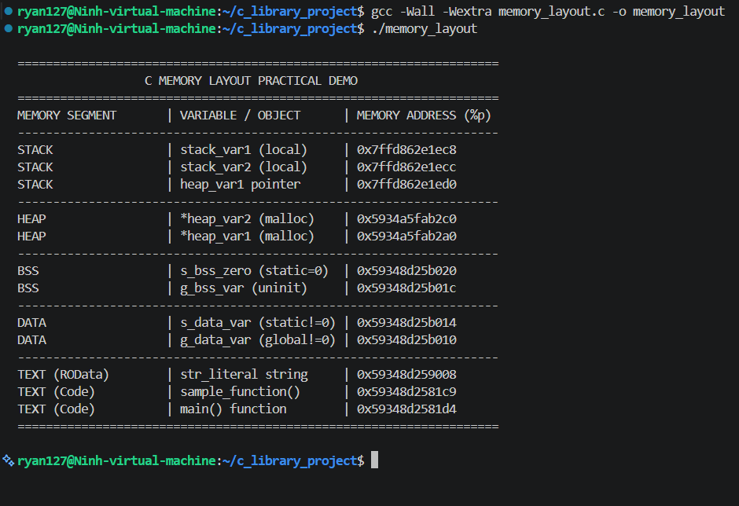

*Hình 6.1: Kết quả in địa chỉ ô nhớ.*

</div>


### 7.3. Phân tích quan sát từ địa chỉ thực tế:
1. **Thứ tự 5 phân vùng:**
   * Địa chỉ tăng dần từ thấp đến cao:
     * **TEXT Segment:** Thấp nhất (`0x59348d2581c9` - mã hàm, `0x59348d259008` - hằng chuỗi).
     * **DATA Segment:** Nằm ngay trên Text (`0x59348d25b010` - `0x59348d25b014`).
     * **BSS Segment:** Nối tiếp ngay sau Data (`0x59348d25b01c` - `0x59348d25b020`).
     * **HEAP Segment:** Nằm ở vùng địa chỉ cao hơn (`0x5934a5fab2a0` - `0x5934a5fab2c0`).
     * **STACK Segment:** Nằm ở vùng địa chỉ rất cao trên đỉnh bộ nhớ ảo (`0x7ffd862e1ec8`).
2. **Cơ chế cấp phát của Stack Segment:**
   * Toàn bộ biến cục bộ (`stack_var1`, `stack_var2`, `heap_var1 pointer`) được gom trong khung ngăn xếp của hàm tại vùng địa chỉ cao `0x7ffd862e1e...`.
   * Các biến được cấp phát liên tiếp cách nhau đúng 4 bytes (`sizeof(int)` = 4 bytes: `...ec8` $\rightarrow$ `...ecc` $\rightarrow$ `...ed0`).
3. **Chiều phát triển của Heap Segment (Phát triển đi lên - Tăng dần):**
   * Vùng nhớ `heap_var1` được cấp phát trước nằm ở địa chỉ `0x5934a5fab2a0`.
   * Vùng nhớ `heap_var2` được cấp phát sau nằm ở địa chỉ `0x5934a5fab2c0` (lớn hơn địa chỉ trước 32 bytes do bao gồm cả Header quản lý bộ nhớ của `malloc`).
4. **Sự phân chia tối ưu giữa DATA và BSS:**
   * `g_data_var` và `s_data_var` (khởi tạo giá trị `100`, `200`) được đặt trong phân vùng **DATA** (`0x59348d25b010` - `...014`).
   * `g_bss_var` và `s_bss_zero` (chưa gán hoặc gán `= 0`) được xếp vào phân vùng **BSS** (`0x59348d25b01c` - `...020`), giúp tệp thực thi nhị phân không bị phình to dung lượng trên ổ đĩa.


<div align="center">

**Sơ đồ trực quan 5 phân vùng C Memory Layout:**

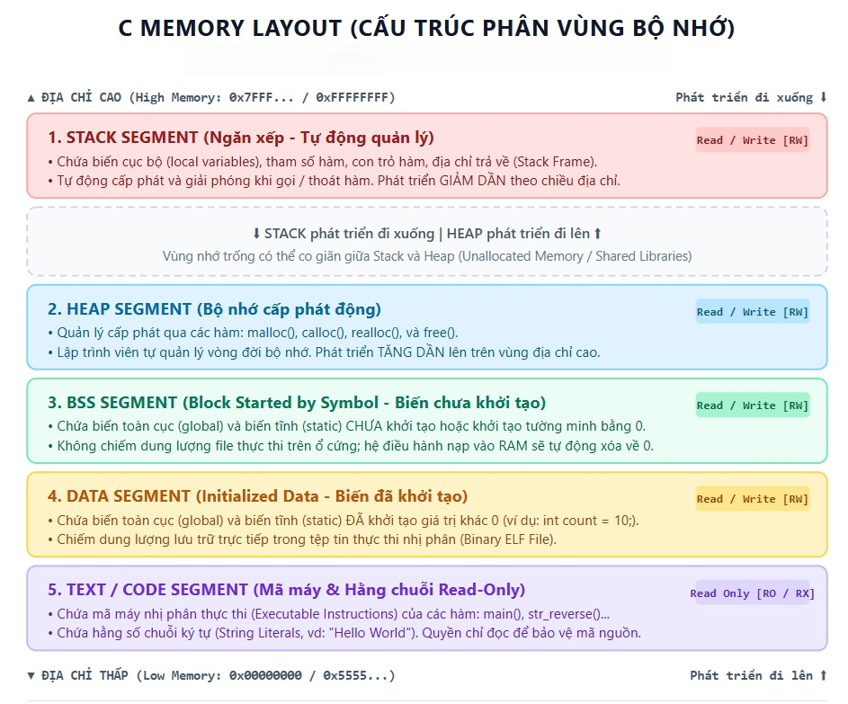

*Hình 6.2: Sơ đồ bản đồ bộ nhớ tiến trình C.*

</div>


